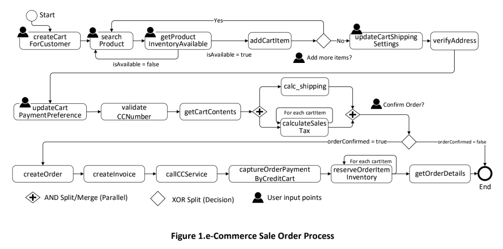

# E-Commerce Sales Order BPEL Process 

**Description:**
Developed a BPEL process for creating an E-Commerce sales order. The process is invoked when a customer visits an online shopping website and requests to create a shopping cart.

Figure 1 shows the control-flow of the e-commerce sales order process. 

 
